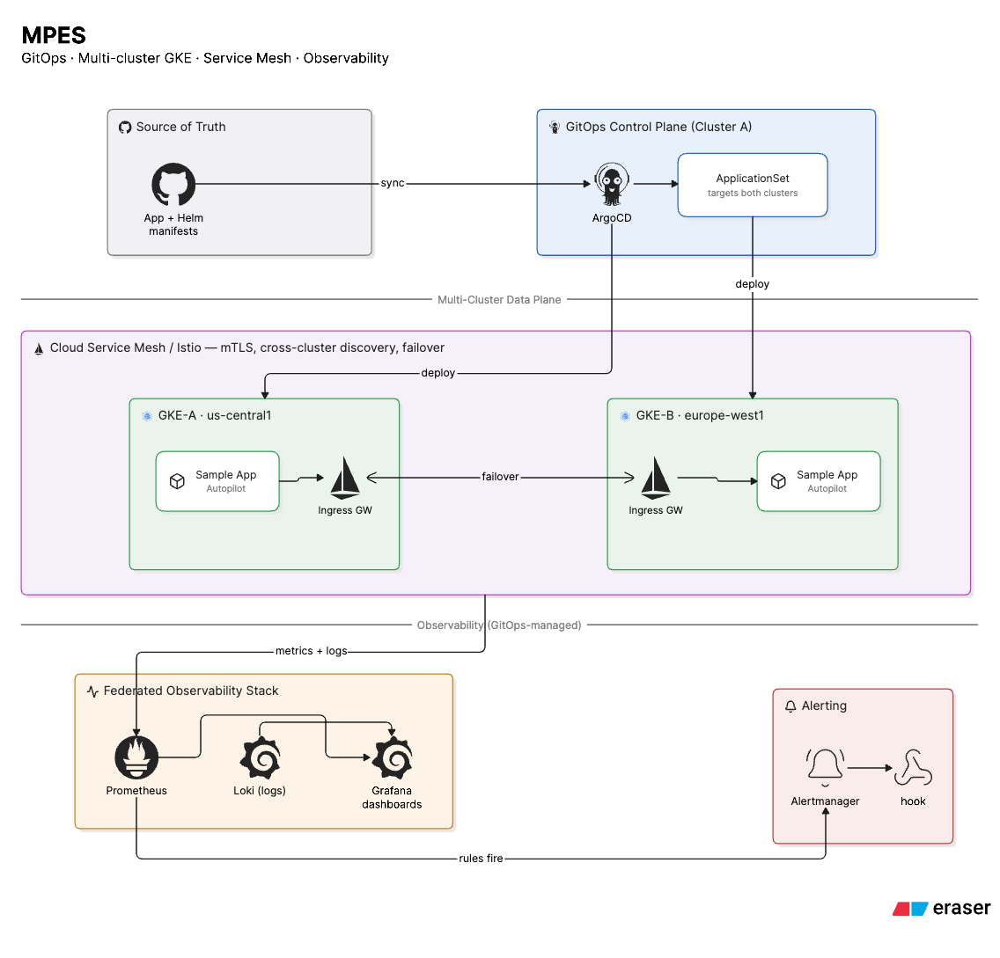

# mpes

idk, multi-region GKE infrastructure and k8s stuff. 

spin up multi-cluster GKE with terraform and let argo figure out the rest.

## what's in here

* `/infrastructure/tf/` - terraform doing terraform things (primary US & secondary EU GKE clusters, VPCs, IAM, Cloud DNS, NAT).
* `/infrastructure/scripts/` - bash scripts that do the heavy lifting (IP whitelisting, Argo CD cluster linking, secret syncing).
* `/kubernetes/bootstrap/` - the gitops entrypoints (`root-platform.yaml` & `root-apps.yaml`).
* `/kubernetes/platform/` - the platform stack (argocd, istio multi-cluster, cert-manager, external-secrets, observability).
* `/kubernetes/apps/` - the actual apps fleet (`kubecounter` and friends).

## how to use

we have a Makefile now so you don't have to remember random `gcloud` commands.

### quick start

1. **spin up everything**:
   ```bash
   make up
   ```
   (this runs `terraform apply`, whitelists your current IP on cluster master networks, fetches kubeconfigs, installs Argo CD on primary cluster, links the secondary cluster, and bootstraps all platform & app GitOps applications).

2. **go get a coffee**:
   ```bash
   make status
   ```

3. **tear it all down cleanly when done**:
   ```bash
   make down
   ```
   (cascade deletes Argo CD apps first so remote namespaces don't get orphaned, unlinks secondary cluster, uninstalls Argo CD, then runs `terraform destroy`).

### useful make targets

* `make allow-ip` - run this when your Wi-Fi changes and `kubectl` starts timing out on master authorized networks.
* `make credentials` - fetch kubeconfig credentials for both primary and secondary clusters.
* `make vault-secrets` - sync Istio certs and cross-cluster remote secrets into GCP Secret Manager.
* `make help` - list all available Makefile targets.

pls don't break production.

---
> see
>
> 
